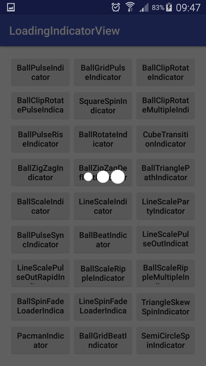

# LoadingIndicatorView Library
My purpose is to use the "AVLoadingIndicatorView" library more conveniently. [here](https://github.com/81813780/AVLoadingIndicatorView).

#Screen Shots
All Indicators


Type of BallPulseIndicator


#Types


## Usage

### Step 1
```groovy
allprojects {
		repositories {
			...
			maven { url 'https://jitpack.io' }
		}
	}
```

### Step 2

Add dependencies in build.gradle.
```groovy
    dependencies {
       compile 'com.github.barisatalay:loadingindicatorview:-SNAPSHOT'
    }
```

### Step 3 (Use of library)
It's very simple use just like .
```java
   //Parameter 1: Activity,
   //Paremeter 2: Message String or String resource Id
   //Parameter 3: Indicator Type   
   LoadingIndicatorView.show(mActivity, "Please Wait", LoadingType.BallPulseIndicator);
   
   //For hide Indicator View
   LoadingIndicatorView.hide();

   //For change text Indicator View
   //Paremeter: Message String / String resource Id
   LoadingIndicatorView.changeText("Downloading..");
```


## Proguard

When using proguard need add rules:

```
-keep class com.wang.avi.** { *; }
-keep class com.wang.avi.indicators.** { *; }
```

Indicators is load from class names, proguard may change it (rename).

## Thanks
- [AVLoadingIndicatorView](https://github.com/81813780/AVLoadingIndicatorView)

##Contact me

 If you have a better idea or way on this project, please let me know, thanks :)

[Email](mailto:b.atalay07@hotmail.com)

[My Blog](http://brsatalay.blogspot.com.tr)

[My Linkedin](http://linkedin.com/in/barisatalay07/)